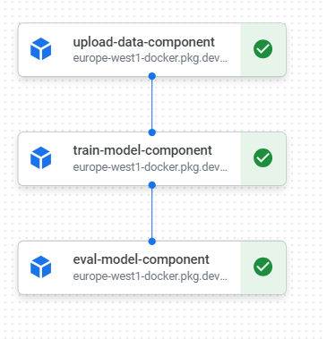

# Kubeflow pipeline in Vertex AI
In this Kubeflow pipeline, a pre-trained Huggingface BERT-model is fine-tuned on a text-classification task. The text-classification task consists of predicting the news category for a given news article. In total there are 42 news categories.

# Pipeline Architecture
Each component in the pipeline has it's own docker image (defined in `images/`) and is implemented inside the `components` directory.

The training pipeline itself is defined in `training_pipeline.py` and  deployed using `deploy.py`. 

## Upload data component
This component preprocesses and uploads a dataset to a Google Cloud Platform (GCP) storage bucket, using a containerized component within a Kubeflow pipeline.

## Train model component
This component is designed to fine-tune a BERT model for classifying news articles into categories and then save and upload the trained model and test data (test data will be used in the eval component) to a Google Cloud Platform (GCP) storage bucket. 

## Eval model component
This component is designed to evaluate a pre-trained BERT model on a dataset, specifically for classifying news articles into categories, and then report the model's performance.